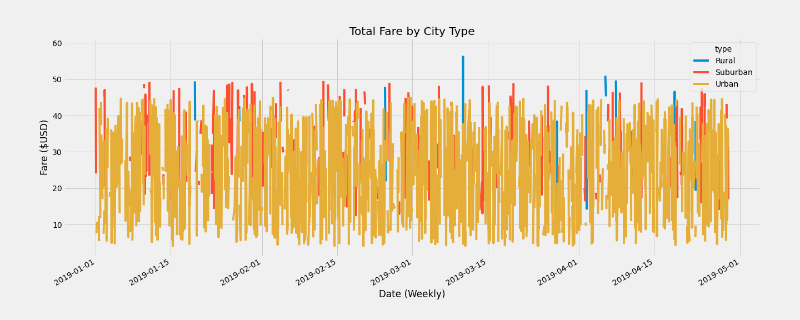
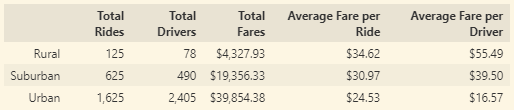

# **Pyber Analysis**

## **Overview**
### Purpose
The analysis contained here breaks down the total fare data by the city type. This analysis provides more context to a large data set and can be leveraged for strategic decision making.

## **Results**
### By City Type Data
The figure below shows the resulting data visual associated with this analysis.

As is displayed, the fares for urban rides are the largest segment compared tothe suburban and rural rides. 

### Pyber Data Summary

## **Reccomendations**

### **Investigate optimization for rural rides**
Looking at the data visual, it is apparent that rural rides are not generating sizeable fares. This makes sense from a consumer perspective given the average fare per ride is more expensive for Rural rides. Finding a way to lower the average fare for consumers to be more in line with suburban rides could help entice using Pyber moreso in the future.

### **Investigate Urban Fares Volatility**
Total fares for Urban rides saw some seemingly uncharacteristic volatility in the month of March. This trend flattened in April and most recently began fares began dipping in the final weeks of April for urban rides. Given the importance of Urban rides in terms of total rides and average fares per ride, this volatility needs to be addressed before future shocks have a more prolonged impact.

### **Solve for Late February Dip Across All City Types**
Fares across all ride types dipped at the end of February. This data does not illuminate the reasons why but would be well worth digging deeper into.

